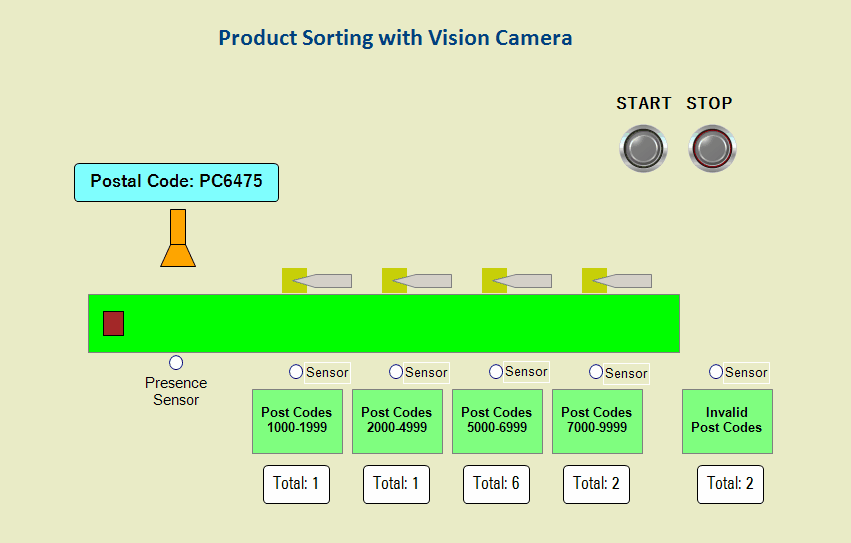
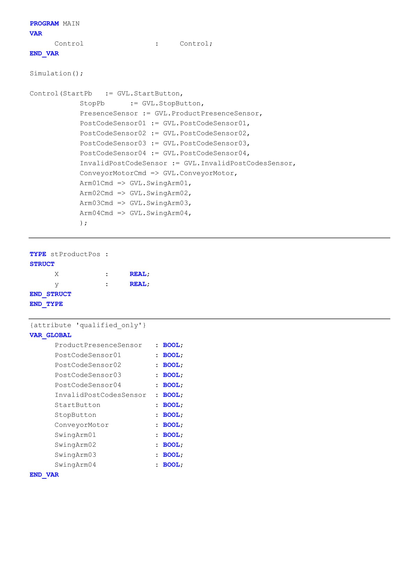
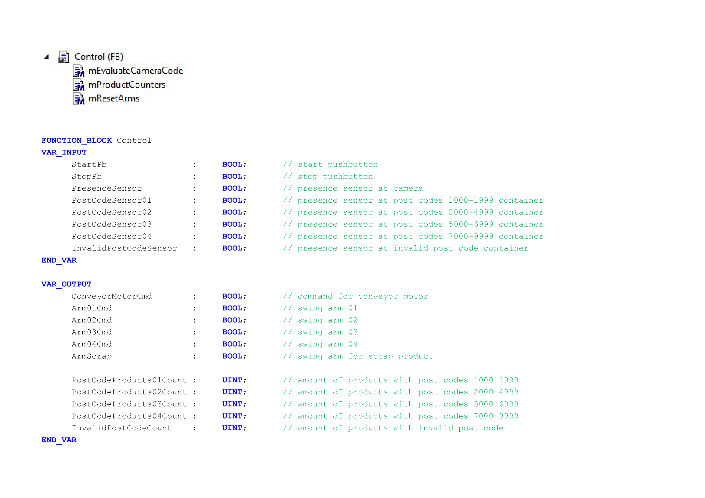
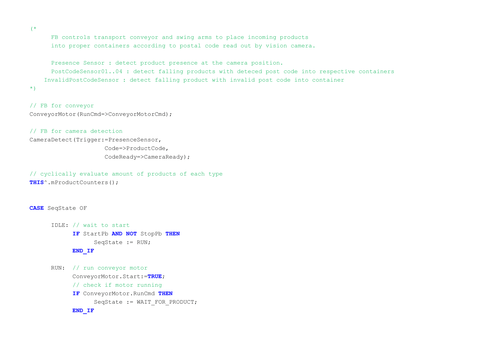
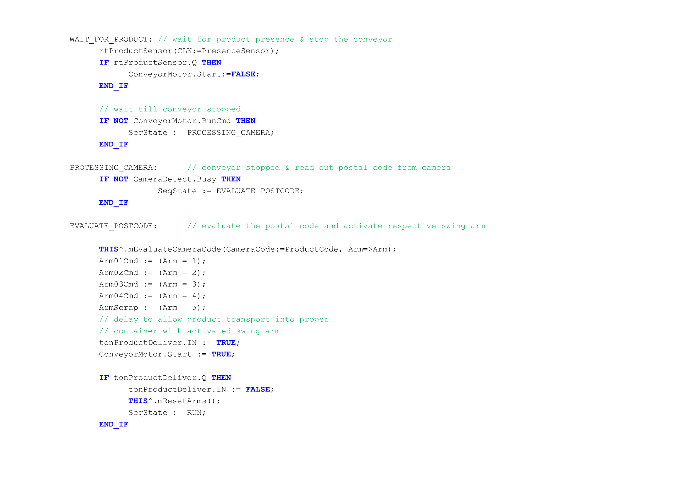
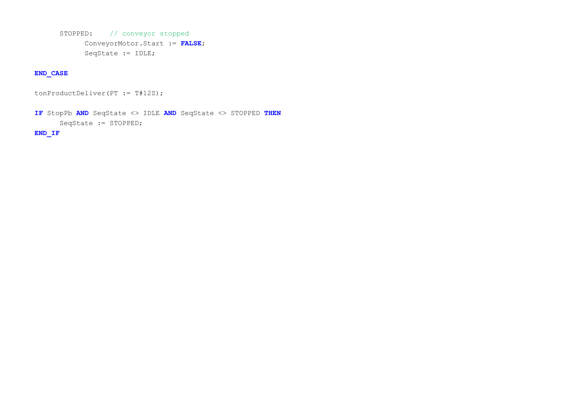
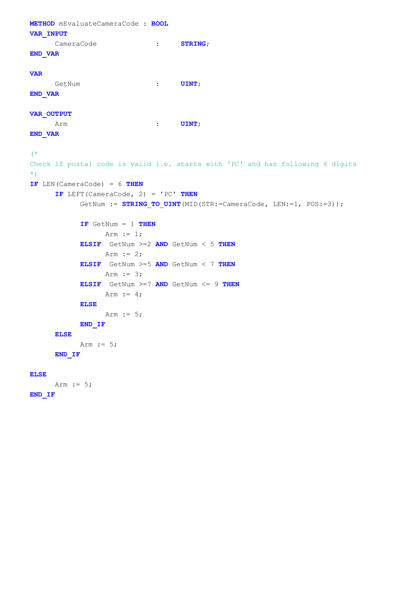
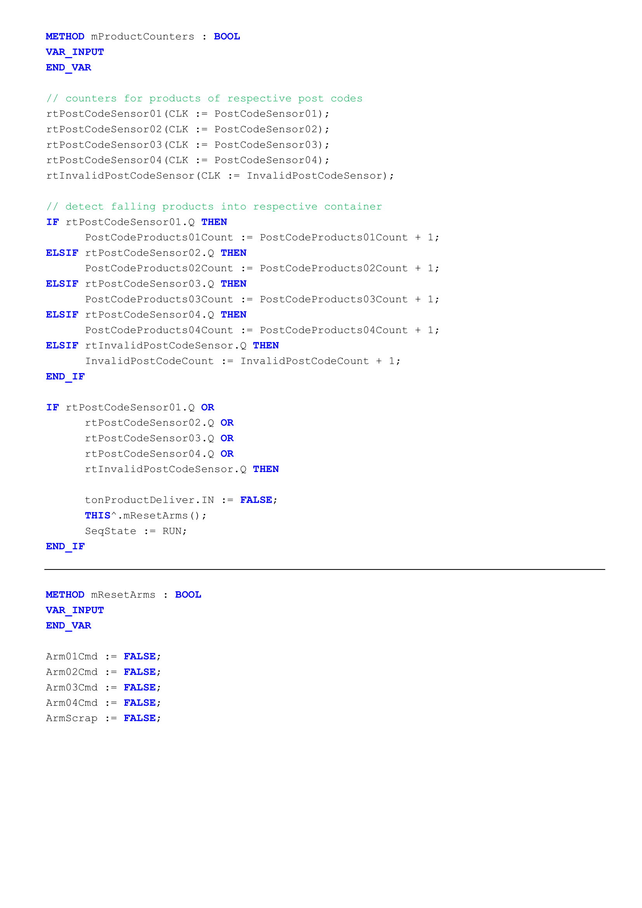
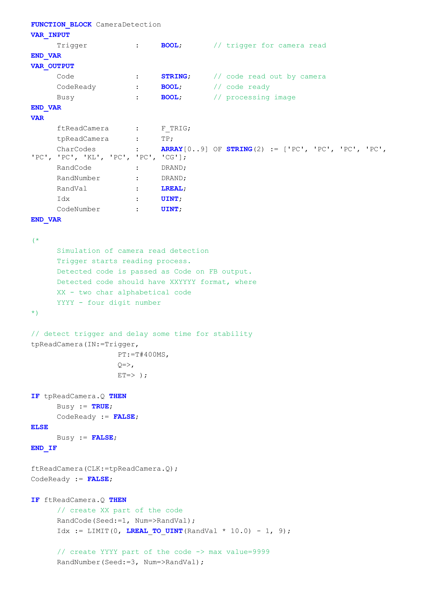
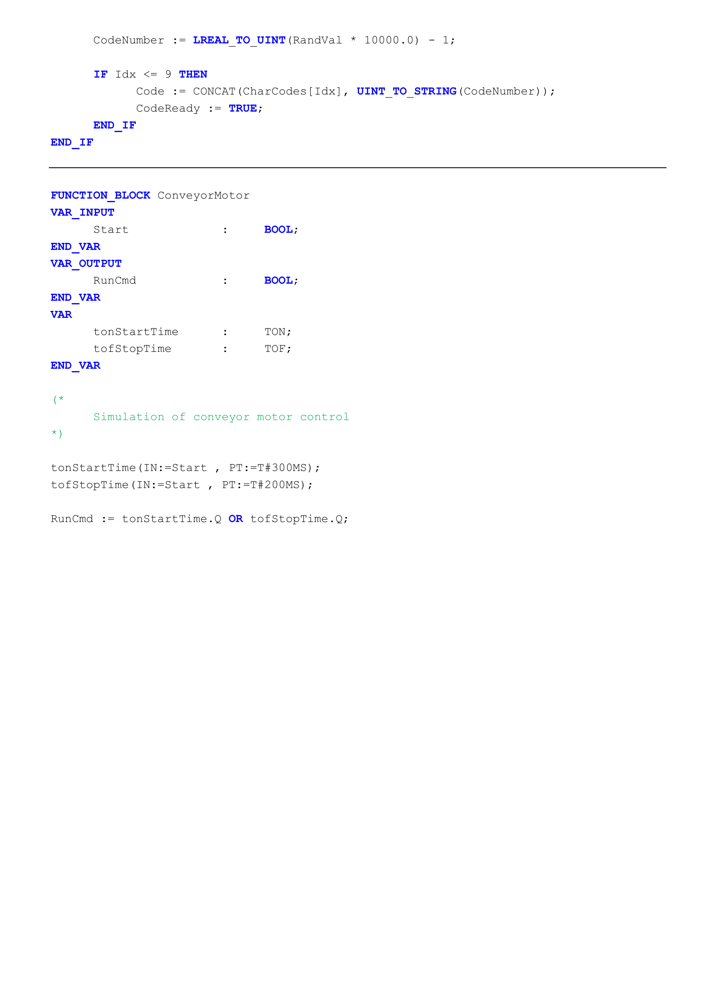

### Sorting Products with Camera

`TwinCAT 3 Project`

The products are transported on a conveyor belt driven by motor. There are four swing arms which can swing out according to the postal code on the product.

Each product has a label with postal code that should be in range between `PC0000` to `PC9999`.

Vision camera reads the postal code when the product is on the proper position (`PresenceSensor`) 
Sometimes there can be no valid post code on the product. Products without a postal code, with unknown postal code or with invalid postal code should go to the last container.

There is only one product on the conveyor belt at a time. When a product is dropped into proper container , the swing arms are reset and next product can be passed by. Products of respective postal codes are counted.

